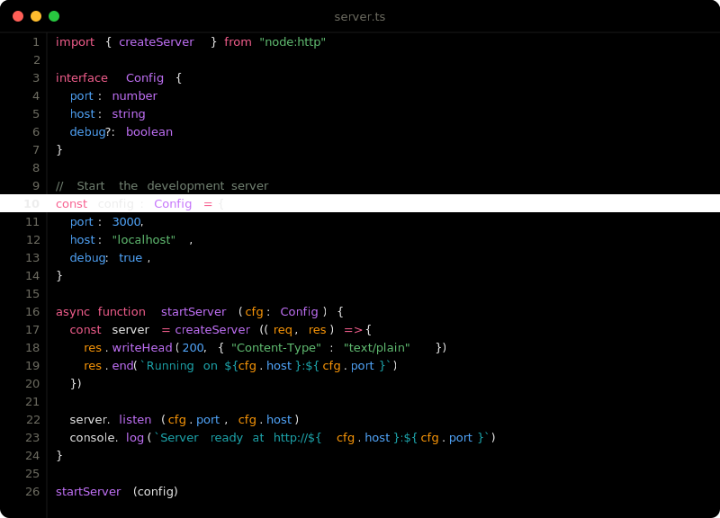
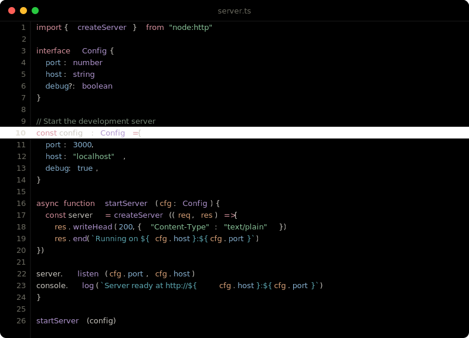
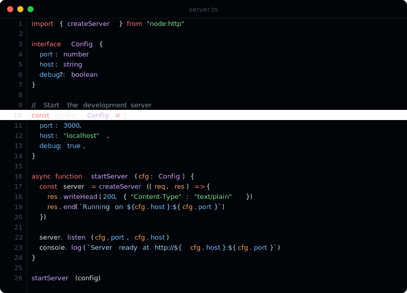
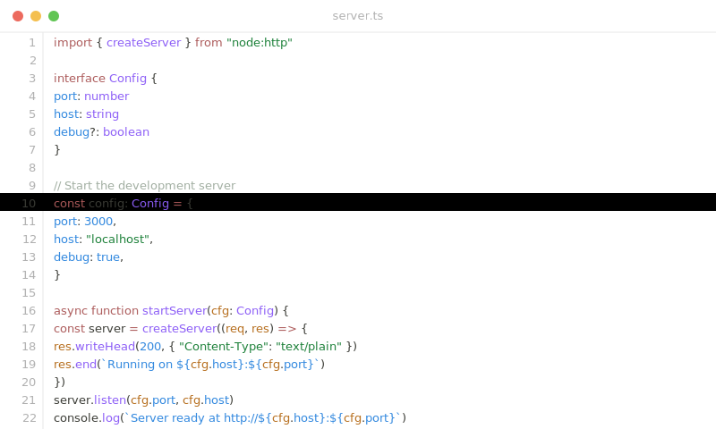

# Void

A minimal theme for [Zed](https://zed.dev) with four variants.

## Variants

### Void

Vibrant colors on pure black.



### Void Soft

Muted, pastel palette on pure black.



### Void GitHub

GitHub Dark-inspired syntax on the darkest GitHub tone (`#010409`).



### Void Light

Clean white background with rich, readable colors.



## Install

### From source

Clone this repo into your Zed themes directory:

```bash
# Flatpak
cp themes/void.json ~/.var/app/dev.zed.Zed/config/zed/themes/

# Native
cp themes/void.json ~/.config/zed/themes/
```

Then open the theme selector in Zed (`cmd+k cmd+t` or `ctrl+k ctrl+t`) and search for **Void**.

## Color Palette

| Role | Void | Soft | GitHub | Light |
|------|------|------|--------|-------|
| Background | `#000000` | `#000000` | `#010409` | `#ffffff` |
| Keyword | `#f75f8f` | `#d9939f` | `#ff7b72` | `#ab5959` |
| String | `#62c073` | `#8ac49a` | `#7ee787` | `#1a7f37` |
| Function | `#c472fb` | `#b196d0` | `#d2a8ff` | `#8b5cf6` |
| Number | `#52a8ff` | `#89b4d4` | `#79c0ff` | `#2e86de` |
| Parameter | `#ff9907` | `#daa278` | `#ffa657` | `#b56c1a` |
| Comment | `#758575` | `#758575` | `#8b949e` | `#a0ada0` |

## License

[MIT](LICENSE)
